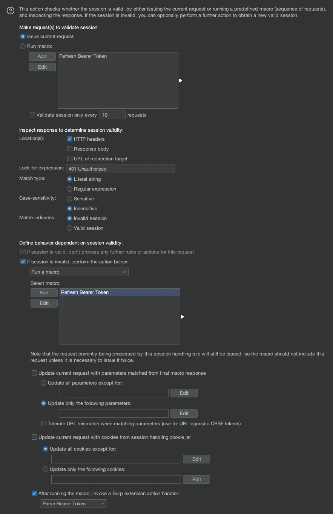

# Dynamic Bearer Token Handler
This Burp extension implements Session Handling Rule Actions to dynamically refresh Bearer tokens in a Client Credentials flow. It was primarily written to be used with Active Scans, which typically last more than the lifetime of short lived Bearer tokens.

## Requirements
[Setup Jython runtime environment](https://burpsuite.guide/runtimes/python/)

## Install
1. In Burp Suite, go to the `Extender` tab
2. Go to `Extensions -> Burp Extensions -> Add`
3. Select Extension type as Python
4. Select the `dynamic-bearer-token-handler.py` file and hit `Next`

## Available Actions
After loading the extension, two Session Handling Rule Actions will be available:
* **Parse Bearer Token** - Extracts a new Bearer token from an Authentication macro response. The current request is updated with the new token, which is stored for subsequent requests.
* **Set Authorization Header** - Sets / updates the `Authorization` header for the current request with the stored token.

## Usage
Follow these steps to configure a Session Handling Rule:
1. Proxy the Authentication request (`/token` endpoint) through Burp;
2. Go to `Project Options -> Sessions`;
3. Add a new Macro. When prompted with the Macro Recorder, select the Authentication request from step 1, and create the Macro;
4. Add a new Session Handling Rule, and:
    1. Add an `Invoke a Burp extension` Rule Action. Select `Set Authorization Header` as the extension handler;
    2. Add a `Check session is valid` Rule Action and apply the following configuration:

    
5. Adjust the Scope for the Session Handling Rule according to needs.

**Note**: If you manually issue requests to the Authentication endpoint, remember to exclude it from the Session Handling Rule Scope.

## Future work.
The extension does not have concurrency control. If the Bearer token expires, each concurrent request will receive a `401 Unauthorized` response and trigger the Authentication macro. This results in several unnecessary Authentication requests. To be addressed.
